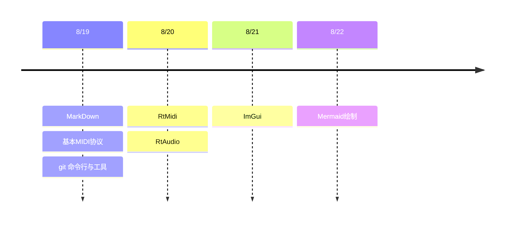

# ***TEST*** (level 1)

-----

## **test** (level 2)

------

>- bullet point

1. 333
2. 3334
   >- inside
3. 323
   
### *Format* (level 3)

|   |1  |2  |
|---|---|---|
|  1|  2|  3|
|  4|  5|  6|

- no
- order
- 123

> block 1
> 
> block 2
> 
> block 3
> 
> block 4

[Github](https://github.com/jerrychen99)

# 8/19 进度

-----

## 浏览6项工具概念及作用

>1. Markdown文件格式
>    - 已学习基础语法：'>', '#', 'Format', '>-', '##', '图片插入'......
>    - 编辑工具：VS Code Markdown Preview Enhanced
>    - bash 脚本语言 （平行运算处理调参数有使用过）
>2. git命令行与工具
>    - empty
>    - empty
>3. 基本MIDI协议
>    - 可选择乐器调试音色、力度、持续时间
>    - Note on delta = 0 为立刻发出声音
>    - Note off delta = 480 ticks 为延迟一个四分音符的时间关闭声音
>    - Velocity 为力度可控制声音大小 (0 - 127)
>4. Rtmidi RtAudio库
>    - Rtmidi管理port的连接并接收MIDI指令并发送，RtAudio连接device并且output声音
>5. ImGui库
>    - 只管UI逻辑如button、slider、checkbox需窗口与渲染的合作下才可发挥作用（ex. GLFW创建窗口，OpenGL3画出UI界面）
>6. Mermaid
>    - 能轻易撰写出图表的工具（ex. 流程图、时序图、类图......）

## 规划
